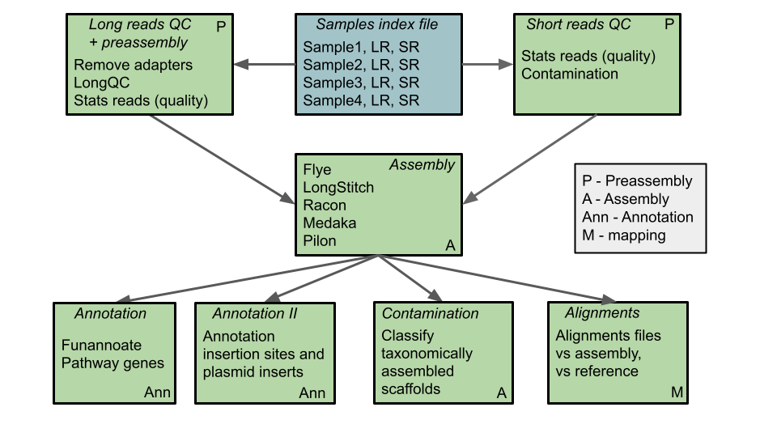

# sageflow - proprietary pipeline of Willow Biosciences

Snakemake pipeline for yeast genome assemblies and annotations     

includes modules      
* 00 - reads preprocessing      
* 01 - genome assemblies, correction, consensus and polishing      
* 01bis - reads alignment against self and reference genome
* 02 - genome annotations, for all the genes and also inserts/plasmids 



```assembly-vars.yaml``` contains the variable names and additional files for the pipeline       
The first entry of assembly-vars is a list of samples to be processed ("index_file"). Samples need to be formatted as tab separated and most importantly the header needs to match with the one in the example (data parsing is made based on that):         

```
nam     lr1     lr2     sr1     sr2
Cenpk   /data/SAGE-G/MVG007/fastq_1/barcode01   /data/SAGE-G/MVG007/fastq_2/barcode01   /data/SAGE-G/CenPK2-1D/CenPK2-1D_S1_L001_R1_001.fastq.gz        /data/SAGE-G/CenPK2-1D/CenPK2-1D_S1_L001_R2_001.fastq.gz
MV435   /data/SAGE-G/MVG007/fastq_1/barcode02   /data/SAGE-G/MVG007/fastq_2/barcode02   /data/SAGE-G/MVG004/MV435_R1.fastq.gz   /data/SAGE-G/MVG004/MV435_R2.fastq.gz
MV482   /data/SAGE-G/MVG007/fastq_1/barcode03   /data/SAGE-G/MVG007/fastq_2/barcode03   /data/SAGE-G/MVG006/MV482_S9_L001_R1_001.fastq.gz	/data/SAGE-G/MVG006/MV482_S9_L001_R2_001.fastq.gz
...
```
**nam** - prefix name given to all the samples in the pipleline [required]         
**lr1** and **lr2** - fastq_1 and fastq_2 directories containing long read files to be used for the assembly. **l1** is required      
**sr1** - paired-end R1 read file [required]         
**sr2** - paired-end R2 read file [required]  

The ```lr2``` is optional and this is going to be detected by the pipeline. ```l1``` is necessary to the pipleine.           

## Run pipeline

In the same directory with the ```modules```, ```assembly-vars.yaml``` and additional files, run each step of the pipeline as follows:         

```
snakemake -j 48 -s main-snakefile -R --until preassembly #runs preassembly module
snakemake -j 48 -s main-snakefile -R --until assembly #runs assembly module
snakemake -j 48 -s main-snakefile -R --until annotation #runs annotation modules
snakemake -j 48 -s main-snakefile -R --until mapping #runs mapping 
```
Output is created in the current directory.

It is recommended to first run the preassembly and check the quality of the reads (short and long). If QC is okay, proceed with the assembly and annotation. It is recommended to execute each step separately and check the output, the pipeline doesn't run consecutively at the moment (TBD in future).        

Pipleine for PacBio reads is available in the ```utils/pacbio_reads``` directory.
